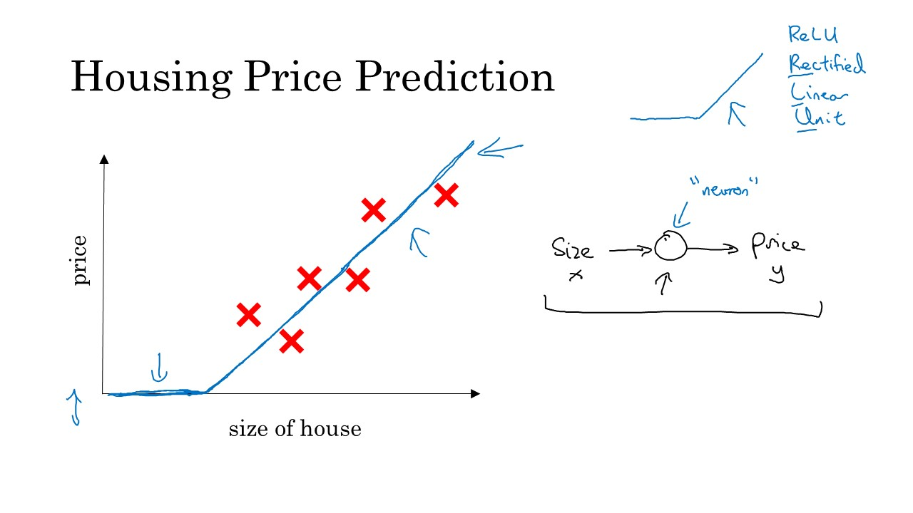
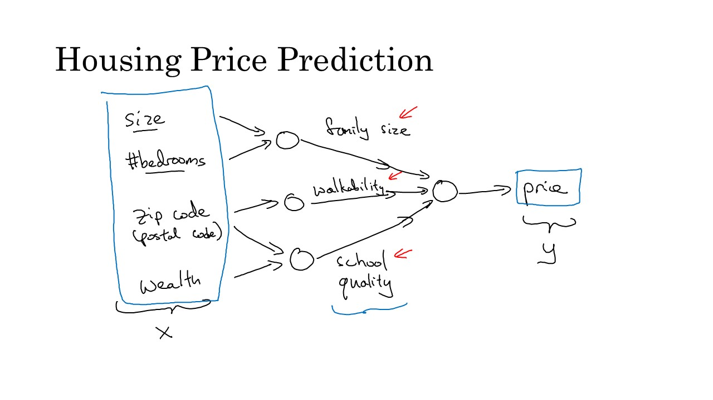
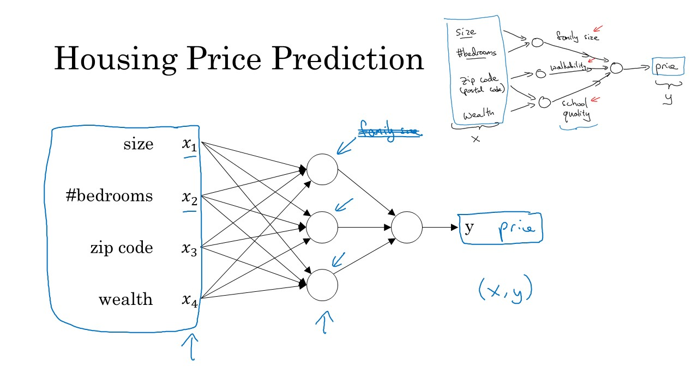
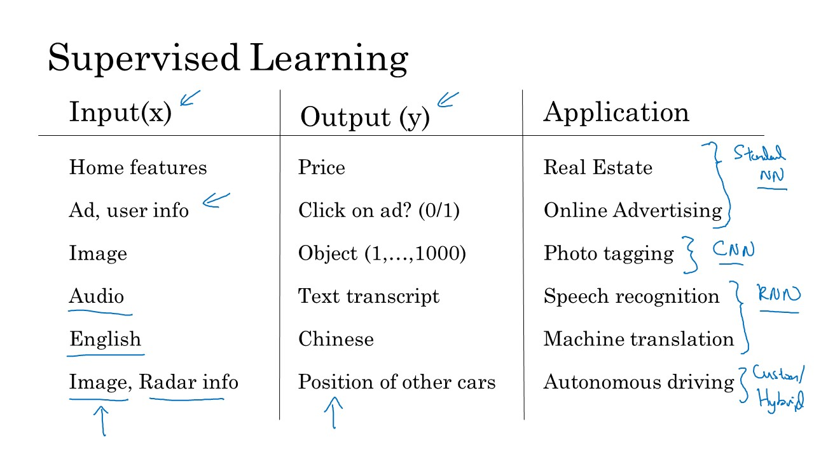
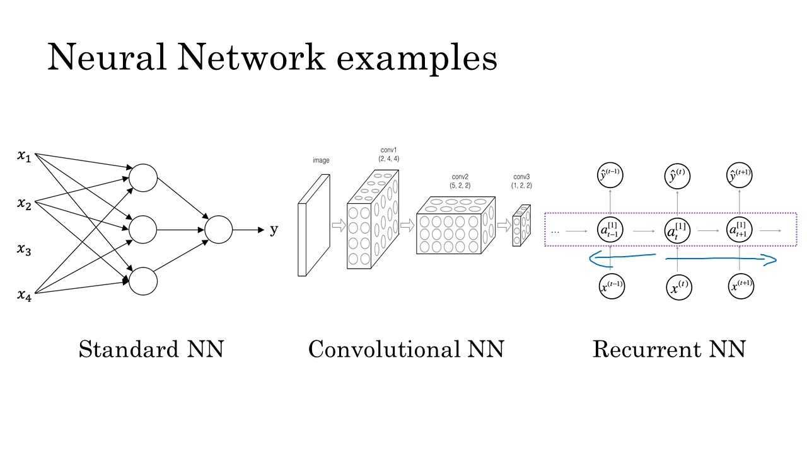
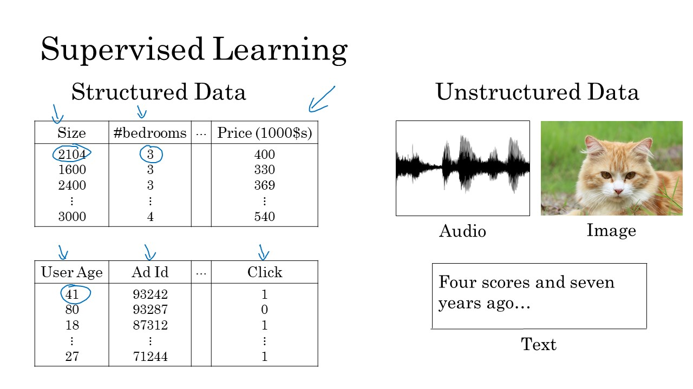
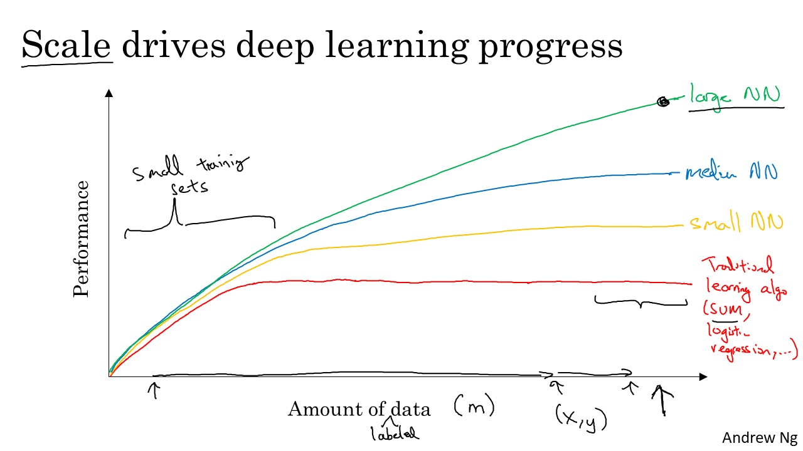
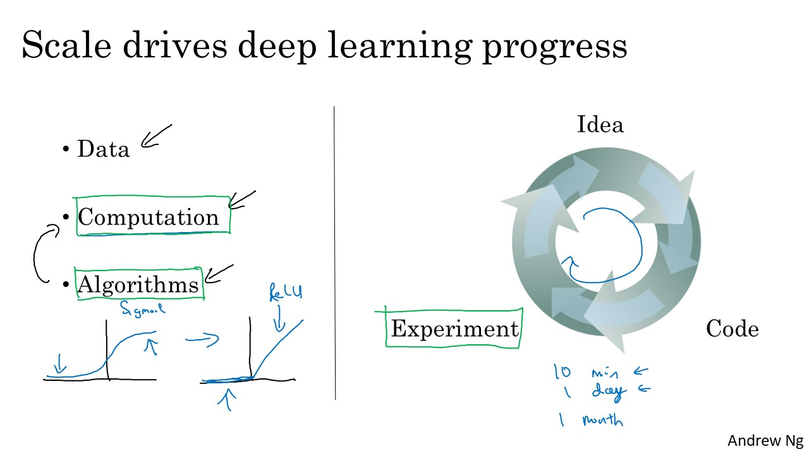
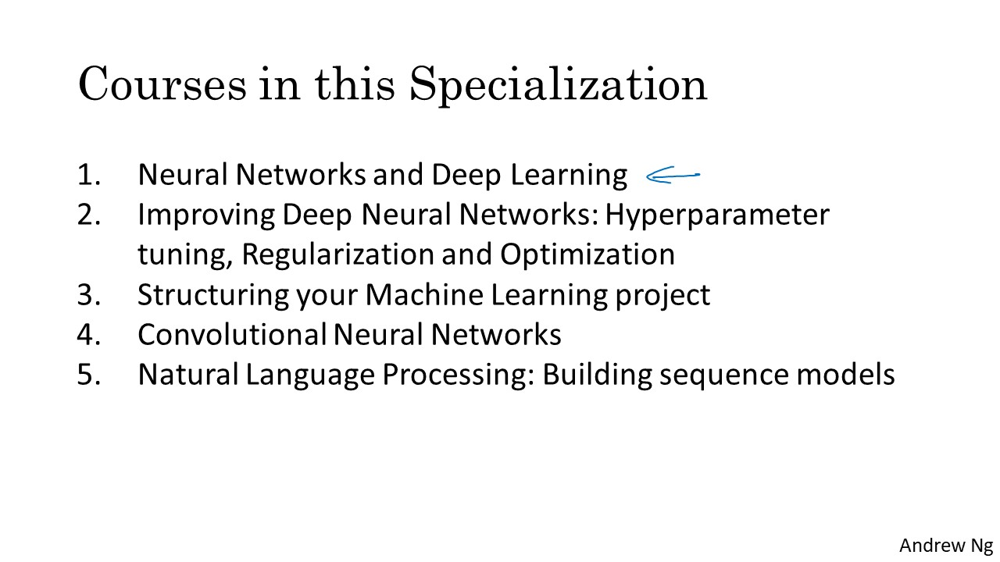
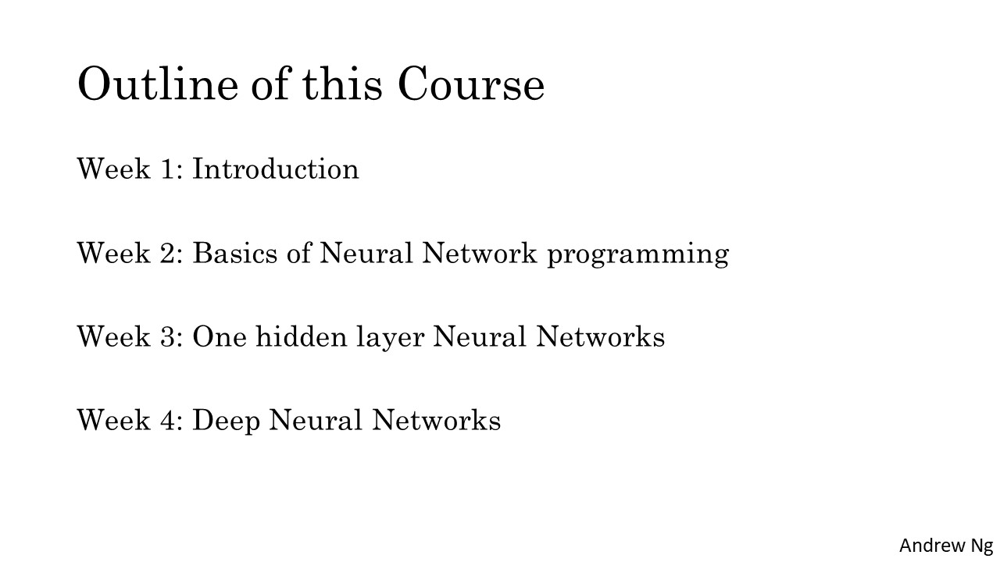

# Welcome to the Deep Learning Specialization

### Table of Contents
- [Welcome](#welcome)
- [Introduction to Deep Learning](#intro)
	- [What is a neural network?](#whatis)
	- [Supervised Learning with Neural Network](#super)
	- [Why is Deep Learning taking off?](#deep)
	- [About the Course](#about)

## Welcome

# Introduction to Deep Learning

## What is a neural network?

## Supervised Learning with Neural Network

## Why is Deep Learning taking off?

 ## About the Course

