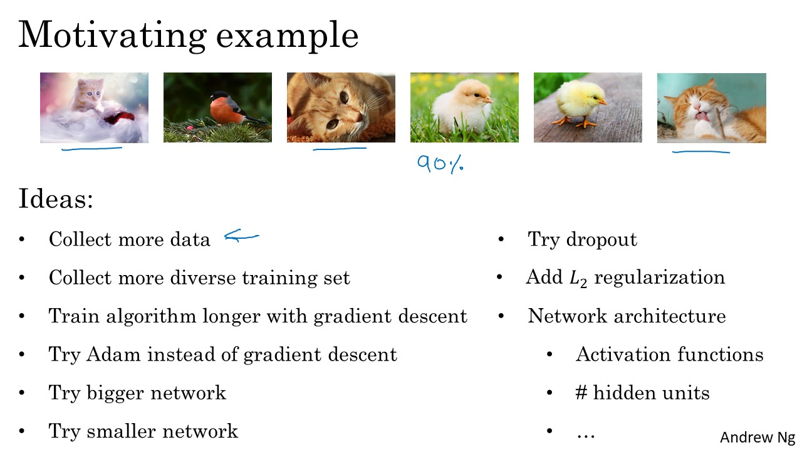
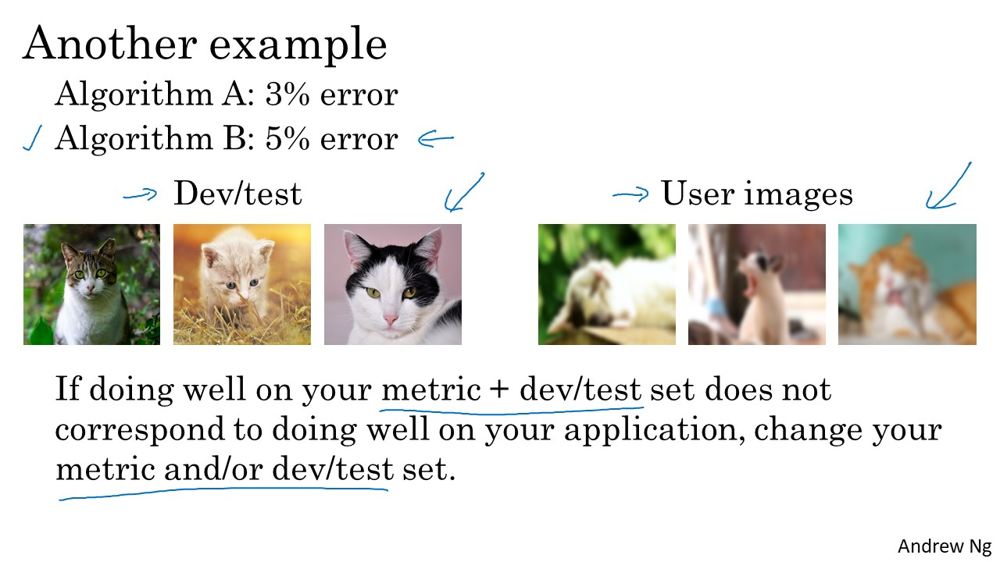

# ML Strategy (1)

### Table of Contents
- [Introduction to ML Strategy](#intro)
	- [Why ML Strategy?](#why)
	- [Orthogonalization](#ortho)
- [Setting up your goal](#setting)
	- [Single number evaluation metric](#single)
	- [Satisficing and Optimizing metric](#satisficing)
	- [Train/dev/test distributions](#train)
	- [Size of the dev and test sets](#size)
	- [When to change dev/test sets and metrics](#when)
- [Comparing to human-level performance](#comparing)
	- [Why human-level performance?](#whyh)
	- [Avoidable bias](#avoidable)
	- [Understanding human-level performance](#understand)
	- [Surpassing human-level performance](#surpass)
	- [Improving your model performance](#improve)

# Introduction to ML Strategy

## Why ML Strategy?

## Orthogonalization

# Setting up your goal

## Single number evaluation metric

## Satisficing and Optimizing metric

## Train/dev/test distributions

## Size of the dev and test sets

## When to change dev/test sets and metrics

# Comparing to human-level performance

## Why human-level performance?

## Avoidable bias

## Understanding human-level performance

## Surpassing human-level performance

## Improving your model performance

