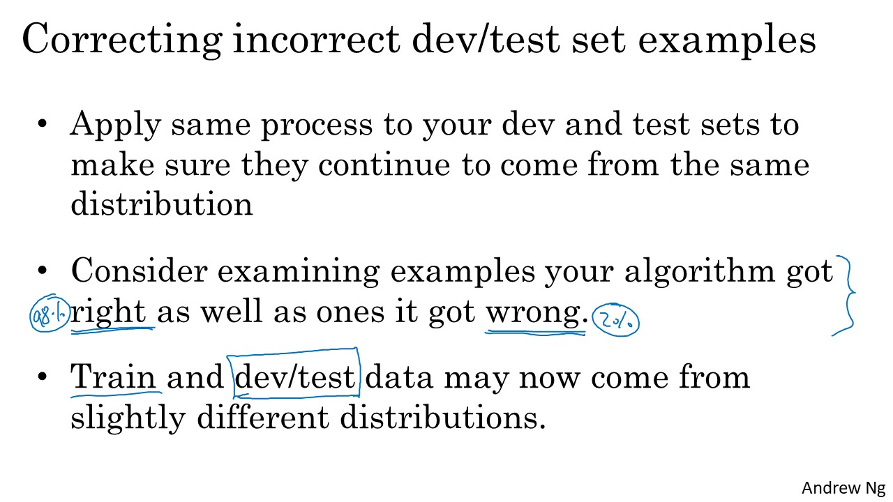
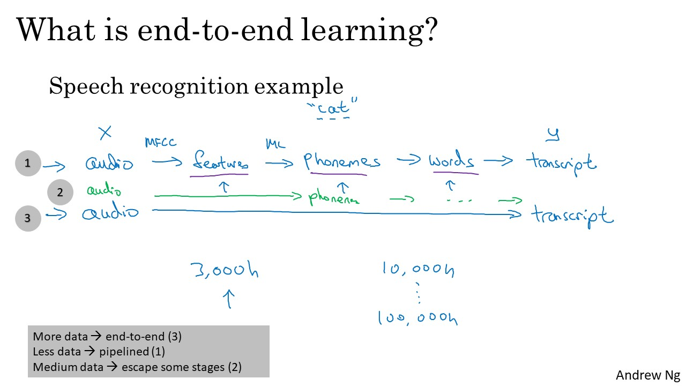
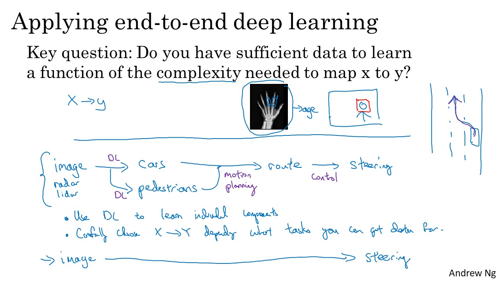

# ML Strategy (2)

### Table of Contents
- [Error Analysis](#error)
	- [Carrying out error analysis](#carrying)
	- [Cleaning up incorrectly labeled data](#cleaning)
	- [Build your first system quickly, then iterate](#build)
- [Mismatched training and dev/test sets](#mismatched)
	- [Training and testing on different distributions](#traning)
	- [Bias and Variance with mismatched data distributions](#bias)
	- [Addressing data mismatch](#addressing)
- [Learning from multiple tasks](#learning)
	- [Transfer learning](#transfer)
	- [Multi-task learning](#multi)
- [End-to-End Deep Learning](#end)
	- [What is end-to-end deep learning?](#what)
	- [Whether to use end-to-end deep learning](#whether)

# Error Analysis

## Carrying out error analysis

## Cleaning up incorrectly labeled data

## Build your first system quickly, then iterate

# Mismatched training and dev/test sets

## Training and testing on different distributions

## Bias and Variance with mismatched data distributions

## Addressing data mismatch

# Learning from multiple tasks

## Transfer learning

## Multi-task learning

# End-to-End Deep Learning

## What is end-to-end deep learning?

## Whether to use end-to-end deep learning

